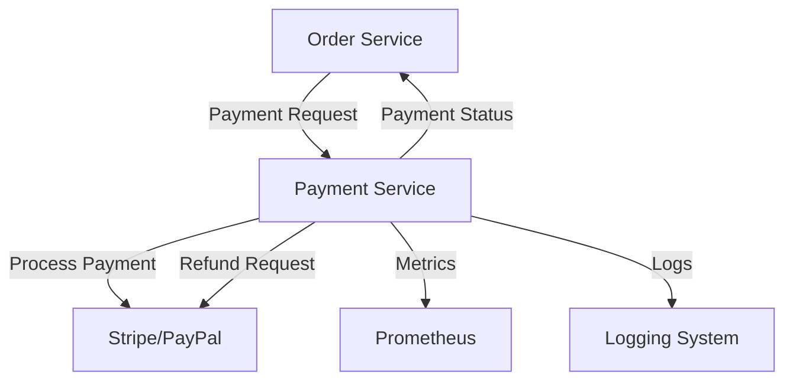

# Payment Service - Event Ticketing & Seat Reservation System

A comprehensive Payment Service microservice for the Event Ticketing & Seat Reservation System, built with Node.js, Express, and MongoDB. This service handles payment processing, refunds, and integrates with multiple payment gateways including Stripe and PayPal.

## 🚀 Features

- **Payment Processing**: Support for Stripe, PayPal, and bank transfers
- **Idempotency**: Ensures safe retry of payment operations
- **Status Tracking**: PENDING, SUCCESS, FAILED, REFUNDED, CANCELLED
- **Refund Management**: Full and partial refunds with reason tracking
- **Monitoring**: Prometheus metrics and structured logging
- **Security**: JWT authentication, rate limiting, input validation
- **High Availability**: Redis caching, health checks, graceful shutdown
- **Containerization**: Docker and Kubernetes support

## 📋 Requirements

- Node.js 18+
- MongoDB 7.0+
- Redis 7+
- Docker (optional)
- Kubernetes (optional)

## 🛠️ Installation

### Local Development

1. **Clone the repository**
   ```bash
   git clone <repository-url>
   cd payment-service
   ```

2. **Install dependencies**
   ```bash
   npm install
   ```

3. **Environment Setup**
   ```bash
   cp env.example .env
   ```
   
   Update the `.env` file with your configuration:
   ```env
   PORT=3004
   MONGODB_URI=mongodb://localhost:27017/payment-service
   REDIS_URL=redis://localhost:6379
   JWT_SECRET=your-super-secret-jwt-key-here
   STRIPE_SECRET_KEY=sk_test_your_stripe_secret_key
   PAYPAL_CLIENT_ID=your_paypal_client_id
   PAYPAL_CLIENT_SECRET=your_paypal_client_secret
   ```

4. **Start the service**
   ```bash
   # Development
   npm run dev
   
   # Production
   npm start
   ```

### Docker Deployment

```bash
# Build and start all services
docker-compose up -d

# View logs
docker-compose logs -f payment-service

# Stop services
docker-compose down
```

### Kubernetes Deployment

```bash
# Apply all manifests
kubectl apply -f k8s/

# Check deployment status
kubectl get pods -n ticketing-system

# Access service
kubectl port-forward svc/payment-service-nodeport 3004:3004 -n ticketing-system
```

## 📚 API Documentation

### Authentication
All payment endpoints require JWT authentication via `Authorization: Bearer <token>` header.

### Payment Endpoints

#### Process Payment Charge
```http
POST /api/payments/charge
Content-Type: application/json
Authorization: Bearer <token>
Idempotency-Key: <uuid>

{
  "orderId": "order_123",
  "amount": 20000,
  "currency": "USD",
  "paymentMethod": "stripe",
  "paymentMethodId": "pm_1234567890",
  "description": "Event ticket purchase"
}
```

#### Get Payment by ID
```http
GET /api/payments/:paymentId
Authorization: Bearer <token>
```

#### Get User Payments
```http
GET /api/payments?page=1&limit=10
Authorization: Bearer <token>
```

#### Refund Payment
```http
POST /api/payments/:paymentId/refund
Content-Type: application/json
Authorization: Bearer <token>

{
  "amount": 10000,
  "reason": "requested_by_customer"
}
```

#### Get Payment Statistics
```http
GET /api/payments/stats/overview?startDate=2024-01-01&endDate=2024-12-31
Authorization: Bearer <token>
```

### Health Check Endpoints

| Method | Endpoint | Description |
|--------|----------|-------------|
| GET | `/health` | Service health status |
| GET | `/health/ready` | Readiness check |
| GET | `/health/live` | Liveness check |
| GET | `/metrics` | Prometheus metrics |

## 🏗️ Architecture

### Database Schema

The Payment Service owns the following data:

- **Payments**: Payment records with status tracking
- **Refunds**: Refund history and status
- **Idempotency Keys**: Redis-cached for safe retries

### Service Boundaries

- **Owns**: Payment records, refunds, payment processing
- **Consumes**: Order data from Order Service
- **Publishes**: Payment status updates to Order Service
- **Integrates**: Stripe, PayPal payment gateways

### Inter-Service Communication



## 🔧 Configuration

### Environment Variables

| Variable | Description | Default |
|----------|-------------|---------|
| `PORT` | Server port | 3004 |
| `NODE_ENV` | Environment | development |
| `MONGODB_URI` | MongoDB connection string | mongodb://localhost:27017/payment-service |
| `REDIS_URL` | Redis connection string | redis://localhost:6379 |
| `JWT_SECRET` | JWT secret key | - |
| `STRIPE_SECRET_KEY` | Stripe secret key | - |
| `PAYPAL_CLIENT_ID` | PayPal client ID | - |
| `IDEMPOTENCY_TTL` | Idempotency key TTL (seconds) | 3600 |
| `METRICS_ENABLED` | Enable Prometheus metrics | true |

### Payment Gateway Setup

#### Stripe
1. Create account at https://stripe.com
2. Get API keys from dashboard
3. Add to environment variables

#### PayPal
1. Create developer account at https://developer.paypal.com
2. Create application and get credentials
3. Add to environment variables

## 📊 Monitoring

### Metrics

The service exposes Prometheus metrics:

- `payments_total`: Total payment attempts by status
- `payment_amount`: Payment amount distribution
- `payment_duration_seconds`: Payment processing time
- `refunds_total`: Total refunds by status
- `idempotency_hits_total`: Idempotency key hits
- `active_connections`: Active connections count

### Logging

Structured logging with correlation IDs:

```json
{
  "timestamp": "2024-01-01T12:00:00.000Z",
  "level": "INFO",
  "correlationId": "abc123",
  "message": "Payment processed successfully",
  "paymentId": "pay_1234567890",
  "amount": 20000,
  "currency": "USD"
}
```

### Dashboards

Grafana dashboards are provided for:
- Payment metrics visualization
- Service health monitoring
- Error rate tracking
- Performance analysis

## 🧪 Testing

```bash
# Run all tests
npm test

# Run tests in watch mode
npm run test:watch

# Run tests with coverage
npm run test:coverage
```

## 🔒 Security

- **Authentication**: JWT-based authentication
- **Rate Limiting**: 100 requests per 15 minutes per IP
- **Input Validation**: Joi schema validation
- **Idempotency**: Prevents duplicate payments
- **CORS**: Configurable cross-origin policies
- **Helmet**: Security headers
- **Secrets Management**: Kubernetes secrets for sensitive data

## 🚀 Deployment

### Docker

```bash
# Build image
docker build -t payment-service .

# Run container
docker run -p 3004:3004 --env-file .env payment-service
```

### Kubernetes

```bash
# Create namespace
kubectl apply -f k8s/namespace.yaml

# Apply configurations
kubectl apply -f k8s/configmap.yaml
kubectl apply -f k8s/secret.yaml

# Deploy services
kubectl apply -f k8s/mongodb-deployment.yaml
kubectl apply -f k8s/redis-deployment.yaml
kubectl apply -f k8s/payment-service-deployment.yaml
```

## 📈 Performance

- **Response Time**: < 200ms for payment processing
- **Throughput**: 1000+ payments per minute
- **Availability**: 99.9% uptime target
- **Scalability**: Horizontal scaling with Kubernetes

## 🔄 Workflows

### Payment Processing Flow

1. **Order Service** sends payment request with idempotency key
2. **Payment Service** validates request and creates payment record
3. **Payment Service** processes payment with gateway (Stripe/PayPal)
4. **Payment Service** updates payment status
5. **Payment Service** notifies Order Service of result
6. **Order Service** confirms order or releases seats

### Refund Processing Flow

1. **User** requests refund
2. **Payment Service** validates refund eligibility
3. **Payment Service** processes refund with gateway
4. **Payment Service** updates payment status to REFUNDED
5. **Payment Service** notifies Order Service

## 🐛 Troubleshooting

### Common Issues

1. **Database Connection Failed**
   - Check MongoDB is running
   - Verify connection string
   - Check network connectivity

2. **Redis Connection Failed**
   - Check Redis is running
   - Verify Redis URL
   - Check authentication

3. **Payment Gateway Errors**
   - Verify API keys
   - Check gateway status
   - Review error logs

4. **Idempotency Issues**
   - Check Redis connectivity
   - Verify idempotency key format
   - Review TTL settings

### Logs

```bash
# View service logs
docker-compose logs payment-service

# View Kubernetes logs
kubectl logs -f deployment/payment-service -n ticketing-system

# View specific log files
tail -f logs/combined.log
tail -f logs/error.log
```

## 📝 License

ISC License

## 🤝 Contributing

1. Fork the repository
2. Create a feature branch
3. Make your changes
4. Add tests for new functionality
5. Run the test suite
6. Submit a pull request

## 📞 Support

For support and questions, please open an issue in the repository.
